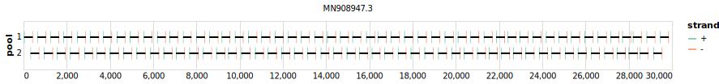

# artic-sars-cov-2 400bp v4.0.0


> If you use this scheme please cite: https://doi.org/10.1101%2F2020.09.04.283077

## Metadata

**Target Organisms:**
- sars-cov-2

**Derived from:** sars-cov-2/artic/400/v3.0.0

## Contributors

- ARTIC network

## Vendors

- IDT: 10011442
- Eurofins ([Website](https://eurofinsgenomics.com))

## Overviews

<div style="width: 100%;"></div>

## Details

```json
{
    "schema_version": "1.0.0-alpha",
    "name": "artic-sars-cov-2",
    "amplicon_size": 400,
    "version": "v4.0.0",
    "contributors": [
        {
            "name": "ARTIC network"
        }
    ],
    "target_organisms": [
        {
            "common_name": "sars-cov-2"
        }
    ],
    "aliases": [
        "ARTIC/V4.0"
    ],
    "license": "CC-BY-SA-4.0",
    "status": "DRAFT",
    "derived_from": "sars-cov-2/artic/400/v3.0.0",
    "citations": [
        "https://doi.org/10.1101%2F2020.09.04.283077"
    ],
    "vendors": [
        {
            "organisation_name": "IDT",
            "kit_name": "10011442"
        },
        {
            "organisation_name": "Eurofins",
            "home_page": "https://eurofinsgenomics.com"
        }
    ],
    "checksums": {
        "primer_sha256": "947142cfa7909fba37b55db3ce9a82aad298db26ea448fae0b8d7c6233b52ed8",
        "reference_sha256": "b09a4a3d6824dc4a9f3a17d480f3335f73cb1507897f6dad0de871e8f00d8637"
    }
}
```


------------------------------------------------------------------------

This work is licensed under a [Creative Commons Attribution-ShareAlike 4.0 International License](http://creativecommons.org/licenses/by-sa/4.0/).

