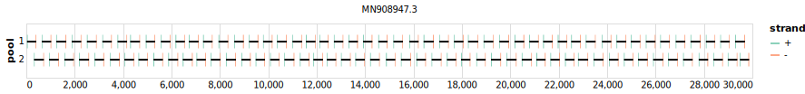

# artic 400bp v2.0.0

[]

> If you use this scheme please cite: https://doi.org/10.1101%2F2020.09.04.283077

[primalscheme labs](https://labs.primalscheme.com/detail/artic/400/v2.0.0)

## Metadata

**Target Organisms:**
- sars-cov-2

**Derived from:** sars-cov-2/artic/400/v1.0.0

## Contributors

- ARTIC network

## Overviews

<div style="width: 100%;"></div>

## Details

```json
{
    "schema_version": "1.0.0-alpha",
    "name": "artic",
    "amplicon_size": 400,
    "version": "v2.0.0",
    "contributors": [
        {
            "name": "ARTIC network"
        }
    ],
    "target_organisms": [
        {
            "common_name": "sars-cov-2"
        }
    ],
    "aliases": [
        "ARTIC/V2"
    ],
    "license": "CC-BY-SA-4.0",
    "status": "DEPRECATED",
    "derived_from": "sars-cov-2/artic/400/v1.0.0",
    "citations": [
        "https://doi.org/10.1101%2F2020.09.04.283077"
    ],
    "primer_checksum": "primaschema:bed:76a07be91780d545",
    "primer_file_sha256": "sha256:ebbdfb9b21607c24e4bcad65a8fe86f9dee7b5c4f4e308f3d5e45eed925b7f32",
    "reference_checksum": "primaschema:ref:21c16fc69acb3b9e",
    "reference_file_sha256": "sha256:b09a4a3d6824dc4a9f3a17d480f3335f73cb1507897f6dad0de871e8f00d8637"
}
```


------------------------------------------------------------------------

This work is licensed under a [Creative Commons Attribution-ShareAlike 4.0 International License](http://creativecommons.org/licenses/by-sa/4.0/)

