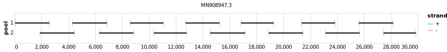

# eden 2500bp v1.0.0

[]

> If you use this scheme please cite: https://dx.doi.org/10.17504/protocols.io.befyjbpw

[primalscheme labs](https://labs.primalscheme.com/detail/eden/2500/v1.0.0)

## Notes

Protocol includes addendum for ONT sequencing

## Metadata

**Target Organisms:**
- sars-cov-2

## Contributors

- John-Sebastian Eden
- Eby Sim

## Overviews

<div style="width: 100%;"></div>

## Details

```json
{
    "schema_version": "1.0.0-alpha",
    "name": "eden",
    "amplicon_size": 2500,
    "version": "v1.0.0",
    "contributors": [
        {
            "name": "John-Sebastian Eden"
        },
        {
            "name": "Eby Sim"
        }
    ],
    "target_organisms": [
        {
            "common_name": "sars-cov-2"
        }
    ],
    "aliases": [
        "sydney"
    ],
    "license": "CC-BY-SA-4.0",
    "status": "DRAFT",
    "citations": [
        "https://dx.doi.org/10.17504/protocols.io.befyjbpw"
    ],
    "notes": [
        "Protocol includes addendum for ONT sequencing"
    ],
    "primer_checksum": "primaschema:bed:26fc59b9ca5c4b8a",
    "primer_file_sha256": "sha256:3816cc533ef389761caedb13b9629a665fd9131af61227957c32289050067e4b",
    "reference_checksum": "primaschema:ref:21c16fc69acb3b9e",
    "reference_file_sha256": "sha256:b09a4a3d6824dc4a9f3a17d480f3335f73cb1507897f6dad0de871e8f00d8637"
}
```


------------------------------------------------------------------------

This work is licensed under a [Creative Commons Attribution-ShareAlike 4.0 International License](http://creativecommons.org/licenses/by-sa/4.0/)

