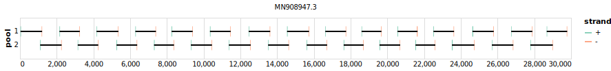

# midnight-sars-cov-2 1200bp v1.0.0-bccdc


> If you use this scheme please cite: https://dx.doi.org/10.17504/protocols.io.bwyppfvn

[primalscheme labs](https://labs.primalscheme.com/detail/midnight-sars-cov-2/1200/v1.0.0-bccdc)

## Notes

Accomodates P.1

## Metadata

**Target Organisms:**
- sars-cov-2

**Derived from:** midnight-v1

## Contributors

- Nikki Freed
- Olin Silander
- John Tyson
- Tracy Lee

## Overviews

<div style="width: 100%;"></div>

## Details

```json
{
    "schema_version": "1.0.0-alpha",
    "name": "midnight-sars-cov-2",
    "amplicon_size": 1200,
    "version": "v1.0.0-bccdc",
    "contributors": [
        {
            "name": "Nikki Freed"
        },
        {
            "name": "Olin Silander"
        },
        {
            "name": "John Tyson"
        },
        {
            "name": "Tracy Lee"
        }
    ],
    "target_organisms": [
        {
            "common_name": "sars-cov-2"
        }
    ],
    "license": "CC-BY-SA-4.0",
    "status": "DEPRECATED",
    "derived_from": "midnight-v1",
    "citations": [
        "https://dx.doi.org/10.17504/protocols.io.bwyppfvn"
    ],
    "notes": [
        "Accomodates P.1"
    ],
    "checksums": {
        "primer_sha256": "ff7fd0957777aa991e5ba4273e0c3cdea8dd091b0cb1078dc0fd23aca5a90634",
        "reference_sha256": "4e43298c083d3da7bfbab890e351e3e58015f9bd7fac1bdee097d11ac89f785d"
    }
}
```


------------------------------------------------------------------------

This work is licensed under a [Creative Commons Attribution-ShareAlike 4.0 International License](http://creativecommons.org/licenses/by-sa/4.0/)

