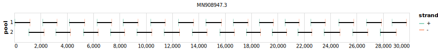

# midnight 1200bp v2.0.0


> If you use this scheme please cite: https://dx.doi.org/10.17504/protocols.io.bwyppfvn

[primalscheme labs](https://labs.primalscheme.com/detail/midnight/1200/v2.0.0)

## Notes

Accomodates Omicron BA.1 with single primer addition

https://twitter.com/freed_nikki/status/1464477522448433156

Not considered a new version by Freed et al. and IDT despite additional primer

## Metadata

**Target Organisms:**
- sars-cov-2

**Derived from:** midnight-v1

## Contributors

- Nikki Freed
- Olin Silander

## Vendors

- Oxford Nanopore Technologies: MRT001.20

## Overviews

<div style="width: 100%;"></div>

## Details

```json
{
    "schema_version": "1.0.0-alpha",
    "name": "midnight",
    "amplicon_size": 1200,
    "version": "v2.0.0",
    "contributors": [
        {
            "name": "Nikki Freed"
        },
        {
            "name": "Olin Silander"
        }
    ],
    "target_organisms": [
        {
            "common_name": "sars-cov-2"
        }
    ],
    "aliases": [
        "midnight-ont-v2",
        "midnight-idt-v1",
        "Midnight-ONT/V2"
    ],
    "license": "CC-BY-SA-4.0",
    "status": "DEPRECATED",
    "derived_from": "midnight-v1",
    "citations": [
        "https://dx.doi.org/10.17504/protocols.io.bwyppfvn"
    ],
    "notes": [
        "Accomodates Omicron BA.1 with single primer addition",
        "https://twitter.com/freed_nikki/status/1464477522448433156",
        "Not considered a new version by Freed et al. and IDT despite additional primer"
    ],
    "vendors": [
        {
            "organisation_name": "Oxford Nanopore Technologies",
            "kit_name": "MRT001.20"
        }
    ],
    "primer_checksum": "primaschema:bed:d4013ab2aca6b292",
    "primer_file_sha256": "sha256:e48d23b772a7c89826b74efcd55ab07ccc586ad95ee13260ff7772db1320df7a",
    "reference_checksum": "primaschema:ref:21c16fc69acb3b9e",
    "reference_file_sha256": "sha256:4e43298c083d3da7bfbab890e351e3e58015f9bd7fac1bdee097d11ac89f785d"
}
```


------------------------------------------------------------------------

This work is licensed under a [Creative Commons Attribution-ShareAlike 4.0 International License](http://creativecommons.org/licenses/by-sa/4.0/)

