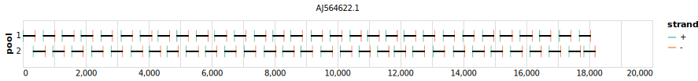

# nipah 400bp v1.0.0


[primalscheme labs](https://labs.primalscheme.com/detail/nipah/400/v1.0.0)

## Metadata

**Target Organisms:**
- niv

## Contributors

- ARTIC network

## Overviews

<div style="width: 100%;"></div>

## Details

```json
{
    "schema_version": "1.0.0-alpha",
    "name": "nipah",
    "amplicon_size": 400,
    "version": "v1.0.0",
    "contributors": [
        {
            "name": "ARTIC network"
        }
    ],
    "target_organisms": [
        {
            "common_name": "niv"
        }
    ],
    "license": "CC-BY-SA-4.0",
    "status": "DRAFT",
    "primer_checksum": "primaschema:bed:e591434473d5dcfa",
    "primer_file_sha256": "sha256:36a2c996015a04344dc700142a43586d84c11b7c27dee62e25079e08f14e6e43",
    "reference_checksum": "primaschema:ref:905352d587958359",
    "reference_file_sha256": "sha256:815c8701e321c2a488e43d70300d0dfbd0a8deb088e784d23935cabf54892a3d"
}
```


------------------------------------------------------------------------

This work is licensed under a [Creative Commons Attribution-ShareAlike 4.0 International License](http://creativecommons.org/licenses/by-sa/4.0/)

