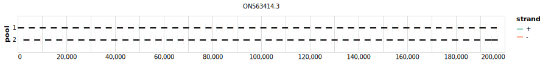

# rigshospitalet 2500bp v1.0.0


> If you use this scheme please cite: https://www.protocols.io/view/monkeypox-virus-whole-genome-sequencing-using-comb-n2bvj6155lk5

[primalscheme labs](https://labs.primalscheme.com/detail/rigshospitalet/2500/v1.0.0)

## Metadata

**Target Organisms:**
- mpxv

## Contributors

- Martin Schou Pedersen
- Matthijs Welkers
- Marcel Jonges
- Anton van den Ouden

## Overviews

<div style="width: 100%;"></div>

## Details

```json
{
    "schema_version": "1.0.0-alpha",
    "name": "rigshospitalet",
    "amplicon_size": 2500,
    "version": "v1.0.0",
    "contributors": [
        {
            "name": "Martin Schou Pedersen"
        },
        {
            "name": "Matthijs Welkers"
        },
        {
            "name": "Marcel Jonges"
        },
        {
            "name": "Anton van den Ouden"
        }
    ],
    "target_organisms": [
        {
            "common_name": "mpxv"
        }
    ],
    "aliases": [
        "erasmus"
    ],
    "license": "CC-BY-SA-4.0",
    "status": "DRAFT",
    "citations": [
        "https://www.protocols.io/view/monkeypox-virus-whole-genome-sequencing-using-comb-n2bvj6155lk5"
    ],
    "checksums": {
        "primer_sha256": "491b706b69f776d4733c2be0f61ccc89e69164d7ccc4a0f0aedd7652d047fe24",
        "reference_sha256": "2415f80de820bcbffddebbb919e8c23e14496932555f73ca5f0705b752b86966"
    }
}
```


------------------------------------------------------------------------

This work is licensed under a [Creative Commons Attribution-ShareAlike 4.0 International License](http://creativecommons.org/licenses/by-sa/4.0/)

